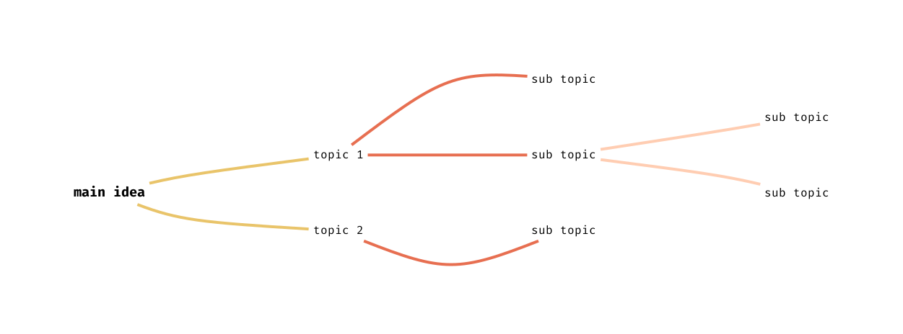
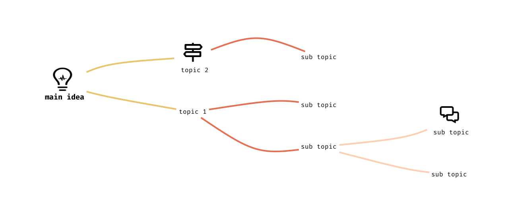
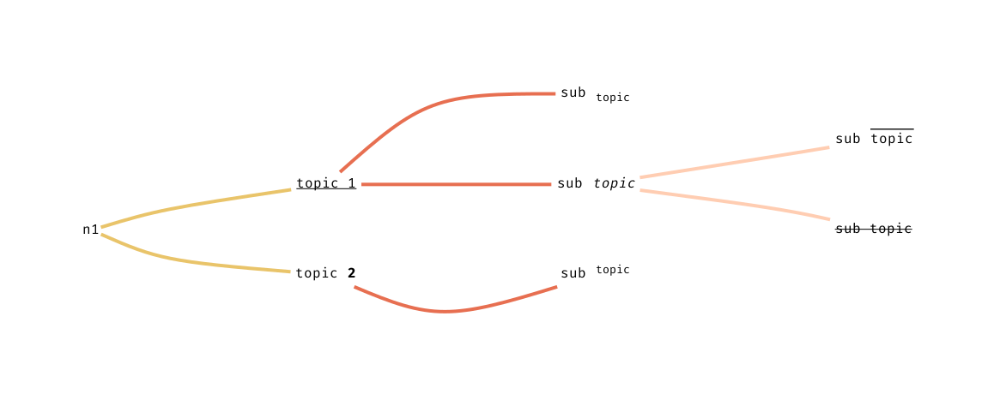

# Crumbs

> Turn asterisk-indented text lines into mind maps.

Organize your notes in a hierarchical tree structure, using a simple text editor.

- an asterisk at the beginning of the line means _level 1_
- two asterisk at the beginning of the line means _level 2_
- and so on...

# How [crumbs](https://github.com/lucasepe/crumbs/releases/latest) works?

- takes in input a text file and generates a [dot script](https://en.wikipedia.org/wiki/DOT_(graph_description_language)) for [Graphviz](https://graphviz.gitlab.io/download/).

- depends on [GraphViz](https://graphviz.gitlab.io/download/)
  - look at the bottom for info about [how to install graphviz](#how-to-install-graphViz).


## Example (without icons)

Create a simple text file - let's say `meeting-ideas.txt`:

```text
* main idea
** topic 1
*** sub topic
*** sub topic
**** sub topic
**** sub topic
** topic 2
*** sub topic
```

To create the PNG image you can 

- _"inject"_ the text file to [crumbs](https://github.com/lucasepe/crumbs/releases/latest) and then the result to [dot](https://graphviz.org/doc/info/command.html) redirecting the output to the file `meeting-ideas.png` - (I love the Linux command pipelines! 😍)

```bash
cat meeting-ideas.txt | crumbs | dot -Tpng > meeting-ideas.png
```

- or as alternative you can specify your text file to [crumbs](https://github.com/lucasepe/crumbs/releases/latest) directly:

```bash
crumbs meeting-ideas.txt | dot -Tpng > meeting-ideas.png
```

Here the output:



---

## Example (with icons)

You can, eventually, add images too (one for text line) using a special syntax: `[[path/to/image.png]]`

- if you specify the flag `-image-path` you can write `[[image.png]]` instead of `[[path/to/image.png]]`
- if you specify the flag `-image-type` you can write `[[path/to/image]]` instead of `[[path/to/image.png]]`
- therefore if you specify both you can write `[[image]]` instead of `[[path/to/image.png]]`

```text
* [[./png/bulb.png]] main idea
** topic 1
*** sub topic
*** sub topic
**** [[./png/comments-alt.png]] sub topic
**** sub topic
** [[./png/map-signs.png]] topic 2
*** sub topic
```

then as usual, let's feed graphviz with [crumbs](https://github.com/lucasepe/crumbs/releases/latest):

```bash
crumbs meeting-ideas-with-icons.txt | dot -Tpng > meeting-ideas-with-icons.png
```

and the output is...



## Example (with HTML)

You can enrich the output with a little bit of style, adding some HTML tag.

The following tags are understood:

```html
<b>, <br/>, <i>, <o>, <s>, <sub>, <sup>, <u>
```

```text
* main idea
** <u>topic 1</u>
*** sub <sub>topic</sub>
*** sub <i>topic</i>
**** <s>sub topic</s>
**** sub <o>topic</o>
** topic <b>2</b>
*** sub <sup>topic</sup>
```

then as usual, let's feed graphviz with [crumbs](https://github.com/lucasepe/crumbs/releases/latest):

```bash
crumbs meeting-ideas-with-html.txt | dot -Tpng > meeting-ideas-with-html.png
```

and the output is...



---

# Installation Steps

In order to use the crumbs command, compile it using the following command:

```bash
go get -u github.com/lucasepe/crumbs/crumbs
```

This will create the crumbs executable under your $GOPATH/bin directory.


## Ready-To-Use Releases 

If you don't want to compile the sourcecode yourself, [Here you can find the tool already compiled](https://github.com/lucasepe/crumbs/releases/latest) for:

- MacOS
- Linux
- Windows

---

# CHANGE LOG

👉 [Record of all notable changes made to a project](./CHANGELOG.md)